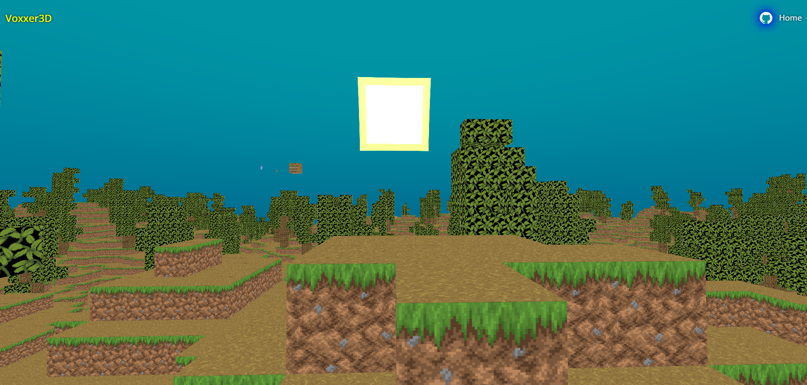
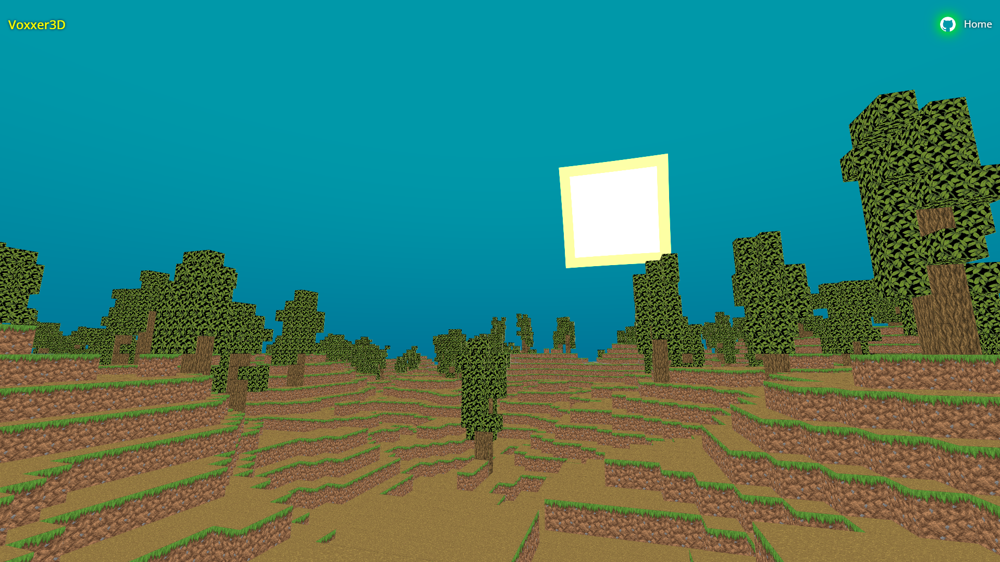
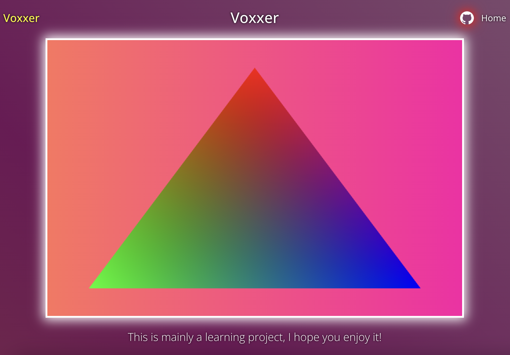
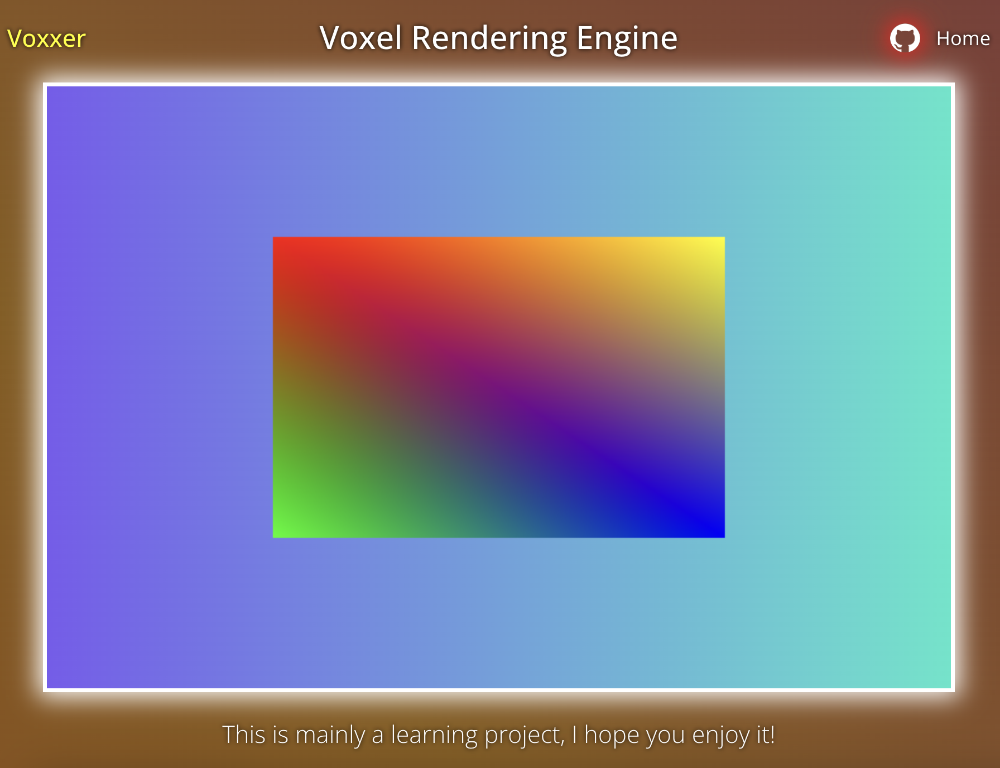
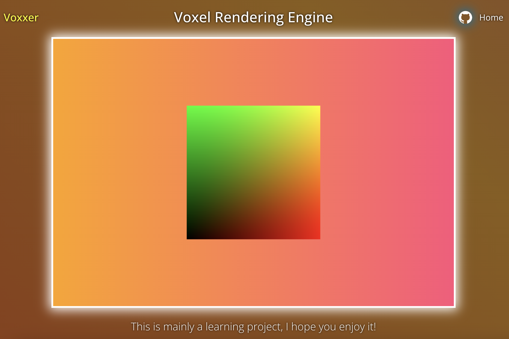
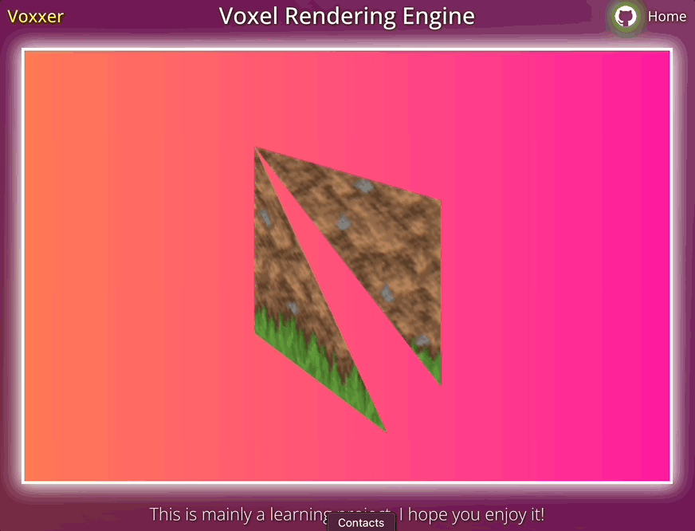
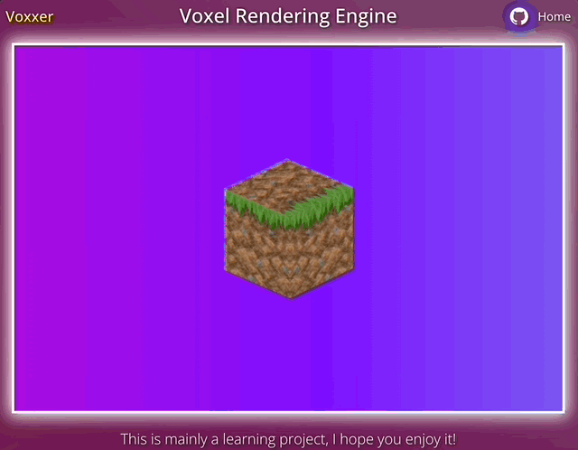
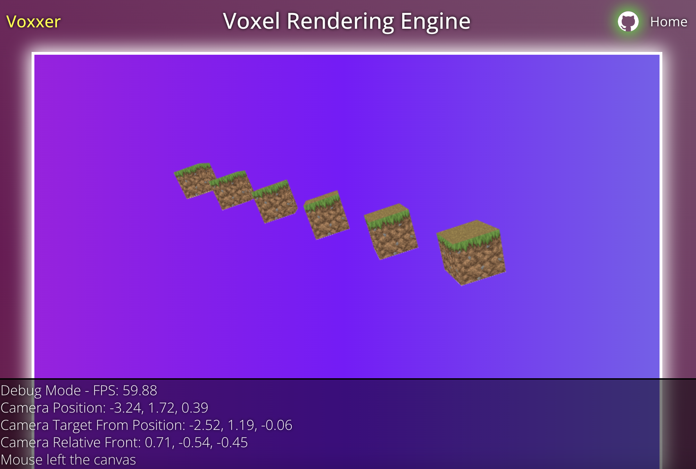
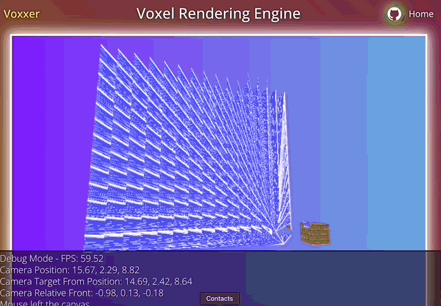
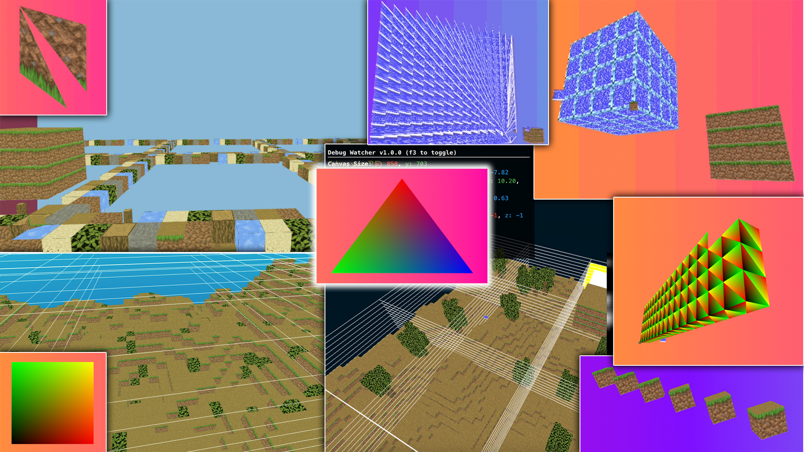

# Voxxer3D

<div align="center">
 
</div>
  
Voxxer3D is a 3D Voxel World Rendering Engine written from "scratch" utilizing the WebGL Interface.  

Since I'm basically creating a minecraft clone, I want to focus on the graphics part & the "hidden" features that exist that isn't obvious at first.

ps. I had no clue to how minecraft works (rendering part of it specifically) and thus a lot of the features might seem "normal" but I never knew it was something I had to "do" that probably didn't make much sense but I hope to just showcase what I learned.

- Features
  - Culling of the following types
    - Backface
    - Chunk bordering faces
    - Inside chunk faces
  - Random procedural terrain generation
    - 2D Noise currently, however 3D was actually possible and created caves
  - Chunk Vertex Builder & Chunk Blocks Array
  - UV Mapping Chunks to specific Texture/Block Type
  - & more...

# Project Requirement Notes
- Have nodejs & npm
  1. Download nodejs & npm (nvm is better than using nodejs installer!)
    - nvm (use nvm to download nodejs!) > https://github.com/nvm-sh/nvm
    - nodejs (I suggest use nvm to install nodejs!) > https://nodejs.org/en
    - npm > https://docs.npmjs.com/downloading-and-installing-node-js-and-npm
  2. Check if you downloaded them properly by doing the below:
    - ```node -v```
    - ```npm -v```

# Building the project
1. Enter the correct directory WebGL-Trial/webgl-main
2. Install dependencies using ```npm i``` in your terminal
3. Run & start the project using ```npm run dev``` in terminal again
4. The website should automatically open on ```localhost:5173```! (Check the terminal incase its a different port! If it is taken Vite will automatically try the next available port.)

# My Platform, Versioning, & Dev environment
I will list what I used, just incase for anyone wondering what I used/platform choice to make this project.
- Mac (Sonoma 14) & Windows 10
- Visual Studio Code / Cursor (Only tried out Cursor for the free trial to test out the IDE it's pretty nice ngl, went back to VSC though)
- npm version ```npm -v```  10.8.2
- node version ```node -v``` v20.17.0
- nvm version ```nvm -v``` 0.39.0

## Project Dependencies
  - Randomness Libraries (Not going to remake hashing)
    - simplex-noise - https://www.npmjs.com/package/simplex-noise
    - seedrandom - https://www.npmjs.com/package/seedrandom
  - **GL-Matrix**
    - For matrix math operations.
  - **Typescript**
    - For obvious reasons.  
  - **Vite**
    - Vite fixed many issues I had previously.
  - **WebGL**
    - Make sure your browser/machine supports WebGL! 
  - *Old/Previous Packages (IGNORE THIS)*
    - Was using lite-server & watcher (replaced by vite).

# Resources
- https://github.com/j-2k/WebGL-Triangle-Boilerplate <<< This contains all the resources for everything related to web stuff what I will put below is only related to webGL & graphics stuff
- [chatgpt.com](https://chatgpt.com/)
  - I'm going to use GPT to help me clarify shit while learning some of the topics below + I will need it especially when doing matrix multiplication & when I need an explanation on what happens when an object goes through 50 transformation calcs lmfao
- WebGL Resources
  - [learnwebgl.brown37.net](https://learnwebgl.brown37.net/rendering/introduction.html) I used this as a intro to WebGL & a refresher for the graphics pipeline. *(spent about 10-15% of my time here)*
  - **[webglfundamentals.org](https://webglfundamentals.org/) I used this for implementation & learning everything, this resource is so fuckin good.** *(spent about 60-75% of my time here, rest of my time went into miscellaneous resources)*
  - [MDN Docs - Web GL](https://developer.mozilla.org/en-US/docs/Web/API/WebGL_API/Tutorial/Getting_started_with_WebGL) This resource is insanely good (Just my personal opinion, above 2 are suggested heavily by seasoned graphics engineers!)
- Looking into hosting services and found this, its a nice website! > https://wheretohostmy.app/free-tier-comparison
    - Used Netlify and it was really fast to setup. Just drag & drop the built project dist files into the host service & thats it! You can get the dist file by doing ```npm run build``` and the dist file will be created.


# Graphics Rendering Pipeline Process
Very important, I will write this out once I fully/almost understand everything in the pipeline.

# Important Computer Graphics Concepts
This is here to list important topics & showcase some things I went through whilst learning CG & WebGL!  
*I want to make this clear, but im trying to learn more about CG rather than WebGL right now, since if you know CG you will adapt to any graphics specification!*

- Projections!
  - Prespective Projection - [Brendan Galea take on Perspective Projection](https://www.youtube.com/watch?v=U0_ONQQ5ZNM&ab_channel=BrendanGalea) | [ScratchAPixel](https://www.scratchapixel.com/lessons/3d-basic-rendering/perspective-and-orthographic-projection-matrix/projection-matrix-introduction.html)
  - Orthographic centering calculation - https://www.desmos.com/calculator/2dzuo1zxky | https://www.desmos.com/calculator/txn0gkfylk
- Model View Projection Matrix
  - https://jsantell.com/model-view-projection/
- Homogenous Coordinates
  - https://www.youtube.com/watch?v=o-xwmTODTUI
- Important Linear Algebra + Matrix Concepts in CG!
  - The list below is things I didn't want to put separately on top of this section, but needed to be mentioned.
  - Matrix Multiplication
  - Translation, Rotation, Scale Matrices / Homogenous Coordinates / Matrix Order
  - Column Major Order vs Row Major Order
  - Matrix Inverse (No need to go in deep but try to understand this concept for the camera!)

# Progress Log
- Following the guide of WebGL Fundamentals on https://webglfundamentals.org/
- Showcasing my progress through the guide. I'm mostly going by order but sometimes I skip around.

## The journey from start to end
| Image      | Description |
| :---:        |    :---:   |
|    | **Fully refactored the backend from the *ORIGINALLY* forked repository *[(Webgl-trial)](https://github.com/j-2k/webgl-trial)*!** |
|  | A |
| | B |
| | C |
|  | D |
|  | E |
|  | F |
|  | G |
|  | H |
|  | I |
|  | J |


